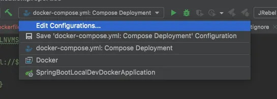
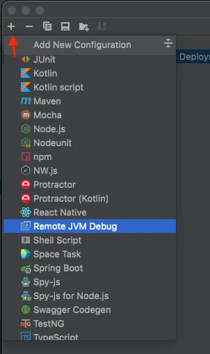
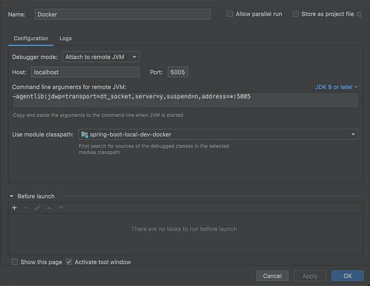

# setup.app

## Pre-requisites
- [Install docker](https://docs.docker.com/engine/install/)
- [Install docker-compose](https://docs.docker.com/compose/install/)

## Integrated development environment
- [IntelliJ](https://www.jetbrains.com/idea/download/#section=linux)

## Starting the application
Open a terminate and run the following command in the project root:
```sh
docker-compose up --build
```

## Starting the application
Open a terminate and run the following command in the project root:
```sh
docker-compose up --build
```

## Configure debug mode
### Open the project in IntelliJ 

#### Edit the run configurations



#### Add new configuration


#### Choose “Remove JVM Debug”. The default options should work. Here’s what my configuration looks like:

